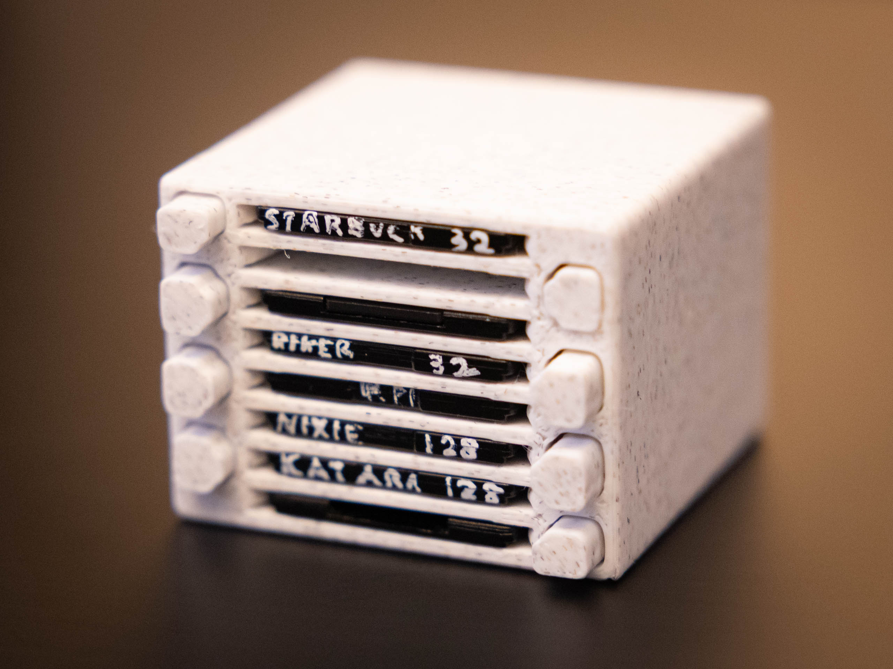

# Stacked camera card holder 

Presenting a compact "print-in-place" card holder to stack your SD cards or CFExpress B cards!

Video: https://www.youtube.com/watch?v=bbGzAtc4VuA



Find on MakerWorld at: https://makerworld.com/en/models/1563816-stacked-sd-card-cfexpress-type-b-card-holder

---------

I wanted something compact that I could attach to my desk, where all the cards can be individually accessed from the front with an "eject" button. I find the result to be very satisfying and practical.

Note that:

- The cards should stay in their slots during normal handling of the case, but this is *not* designed to take on-the-go. (But feel free to adapt the model to include a closing lid!)
- Versions are supported with 4/6/8/10 slots for both card types, and each build plate comes with a tool to snap the supports inside the model. (You only need this tool once per type of card, even if you print multiple designs with different numbers of slots.) Look at [1:25 in the video](https://www.youtube.com/watch?v=bbGzAtc4VuA&t=85s), or perform the following steps for each slot:
  - Hold the snapping tool with your index finger through the loop.
  - Insert into the slot so the longer side is up against the side that has the "eject" button for that slot.
  - Press down, keep the bottom of the tool on the eject button side, and move the top of the tool away.
  - If you really want to avoid using the the tool, you can place a card into a slot and then give it a strong and quick push. This should successfully snap the internal supports for materials in most prints, although I would still recommend using the snapping tool instead.
- The design is easily tuned for other card sizes (or even more slots), but I've only tested for SD cards and CFExpress Type B so far.
- I've found that the design looks and functions nicest using the following filaments
  - [PLA Marble — white](https://us.store.bambulab.com/products/pla-marble?id=41003162992776)
  - [PLA-CF — any color](https://us.store.bambulab.com/products/pla-cf)

The design is implemented entirely in OpenSCAD (https://openscad.org/) is open-sourced under the Creative Commands Attribution-ShareAlike 4.0 International license at: https://github.com/lgarron/camera-card-holder


## Building

This code uses:

- the snapshot channel of OpenSCAD, and
- the [`scad`](https://www.npmjs.com/package/scad) package on `npm`.

Here's an example of how to work on the code on macOS. I personally use [Homebrew](https://brew.sh/) to install `bun` and OpenSCAD:

```shell
brew install bun openscad@snapshot

git clone https://github.com/lgarron/camera-card-holder && cd camera-card-holder
make setup

open -a OpenSCAD ./*.scad
```

To build all variants the way I do, install `openscad-auto`:

```shell
brew install lgarron/lgarron/openscad-auto
make build-for-publish
make build
```

## Compatibility

Note that the code uses and unmerged and unreleased feature for OpenSCAD, naming its groups: https://github.com/openscad/openscad/pull/5942

Stable OpenSCAD is compatible with this, but may show warnings.
